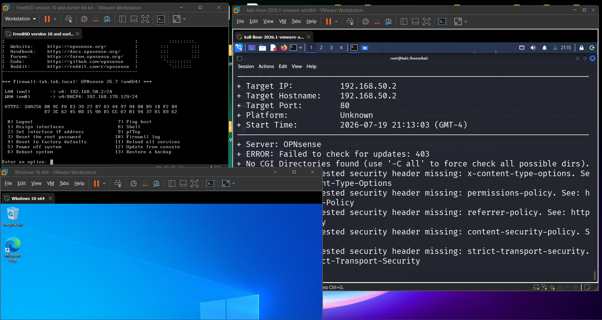
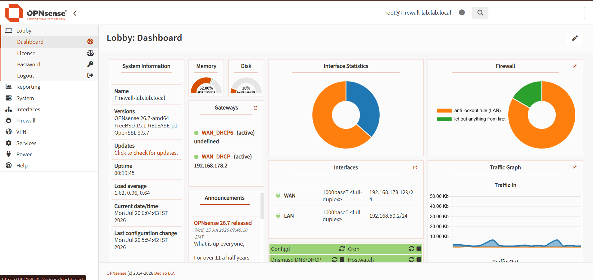
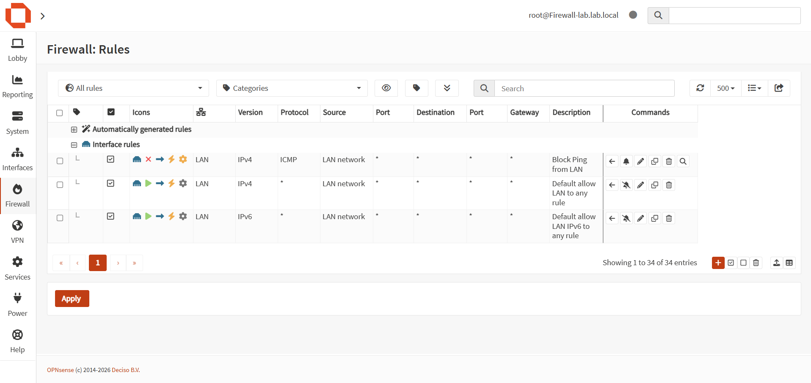
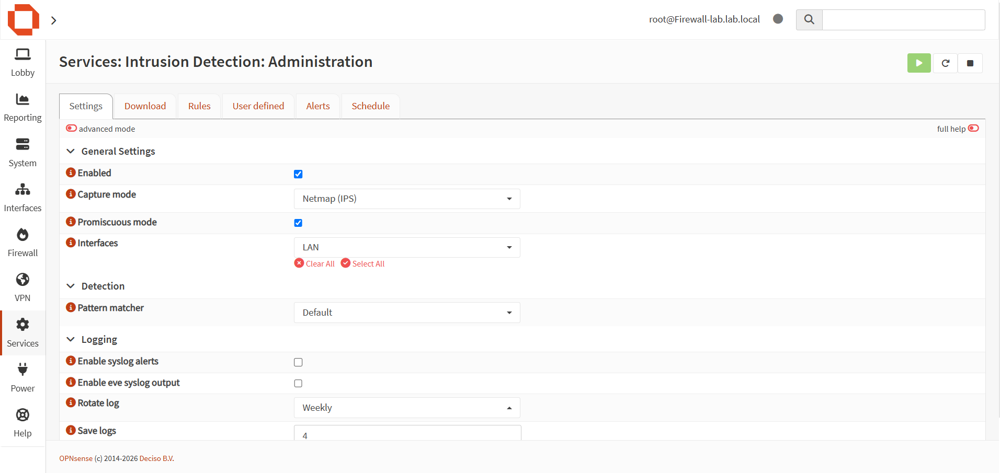
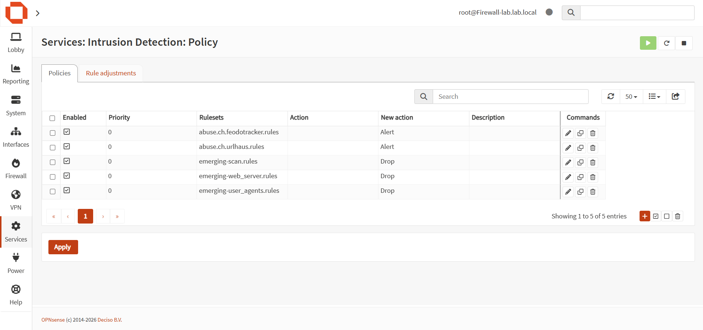
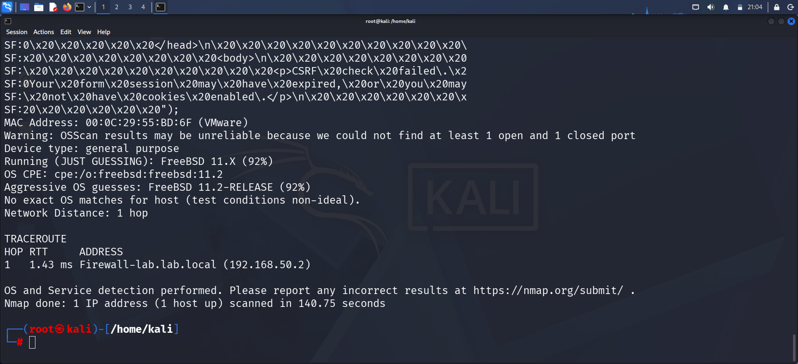
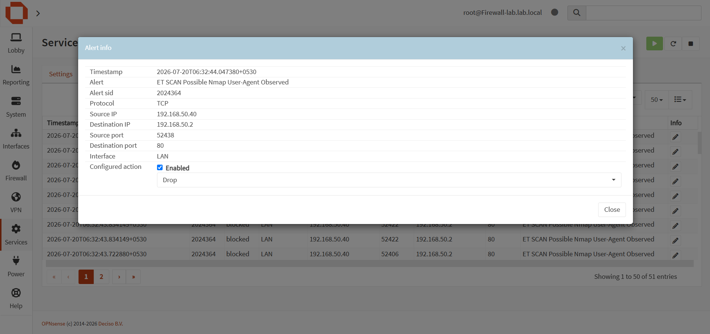
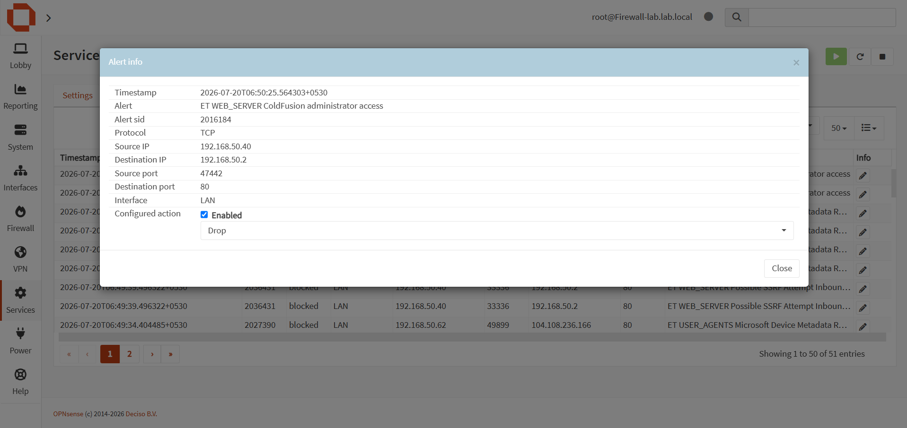
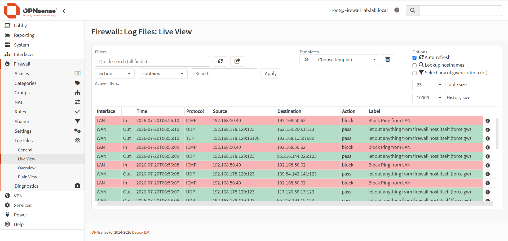

# 🛡️ Enterprise Firewall & IDS/IPS Lab using OPNsense & Suricata

A hands-on enterprise-style network security lab built using **OPNsense Firewall**, **Suricata IDS/IPS**, and **VMware Workstation**. The lab demonstrates how enterprise firewalls inspect, detect, and block malicious network activity using real-world attack simulations.

---

# 📌 Objectives

- Deploy OPNsense Firewall
- Configure Stateful Firewall Rules
- Enable Suricata IDS/IPS
- Simulate Cyber Attacks
- Detect & Block Malicious Traffic
- Analyze Security Alerts

---

# 🏗️ Lab Architecture

```text
                  Internet
                     │
                WAN (NAT)
                     │
        +-------------------------+
        |       OPNsense          |
        | Firewall + Suricata IPS |
        +-------------------------+
                    │
          LAN (192.168.50.0/24)
             ┌──────────────┐
             │              │
      Kali Linux       Windows 10
      (Attacker)        (Victim)
```

---

# 🛠️ Technologies

- VMware Workstation
- OPNsense Firewall
- Suricata IDS/IPS
- Emerging Threats Rules
- Kali Linux
- Windows 10

---

# 🔧 Security Tools

- Nmap
- Nikto
- Gobuster *(Enumeration Only)*

---

# ⚙️ Security Features

- Stateful Firewall
- Custom Firewall Rules
- ICMP Filtering
- Intrusion Detection
- Intrusion Prevention
- Real-Time Alerts
- Live Firewall Logs

---

# 🧪 Attack Simulation

| Tool | Purpose | Status |
|------|---------|--------|
| Nmap | Port Scanning | ✅ Detected & Blocked |
| Nikto | Web Server Scanning | ✅ Detected & Blocked |
| Gobuster | Directory Enumeration | ✅ Executed |

---

# 📸 Screenshots

## VMware Topology



---

## OPNsense Dashboard



---

## Firewall Rules



---

## Suricata Configuration



---

## IPS Mode Enabled



---

## Nmap Attack



---

## Nmap Detection Alert



---

## Nikto Scan


---

## Nikto Detection Alert



---

## Firewall Live Logs



---

# 📚 Skills Demonstrated

- Firewall Administration
- Network Segmentation
- IDS & IPS
- Threat Detection
- Attack Simulation
- Security Monitoring
- Log Analysis
- Network Security

---

# 🚀 Future Improvements

- Custom Suricata Rules
- Gobuster Detection Rules
- OWASP Juice Shop Integration
- Splunk SIEM Integration
- Wazuh Integration
- Sigma Rule Integration

---

# 📄 Conclusion

This project demonstrates the deployment of an enterprise-grade virtual network security lab capable of monitoring, detecting, and blocking malicious activities using OPNsense Firewall and Suricata IDS/IPS. Attack simulations were performed from Kali Linux using Nmap and Nikto to validate real-time detection and prevention capabilities.
